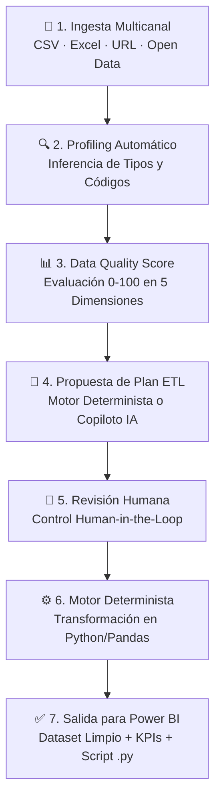

# 🚀 DataFlow AI


*From raw business data to clean, trusted and actionable insights.*  
*Un copiloto inteligente y gobernado para preparación, calidad, transformación y análisis de datos empresariales.*

> 🌐 **Despliegue en Producción:** [https://dataflow-ai-748914382449.us-central1.run.app](https://dataflow-ai-748914382449.us-central1.run.app)  
> ⚠️ **Versión Piloto / MVP:** Diseñado para equipos de BI, Analytics y Operaciones que necesitan datos fiables antes de construir reportes en Power BI.

---

## 🔗 Acceso y Despliegue

### 🌐 Despliegue en Producción (Google Cloud Run)

La plataforma está operativa en **Google Cloud Run** (`us-central1`) con despliegue continuo (CD) en cada push a `main`:

| Recurso | Enlace Directo |
| :--- | :--- |
| 🌐 **Aplicación Web** | [Abrir DataFlow AI](https://dataflow-ai-748914382449.us-central1.run.app) |
| 🔌 **API REST / OpenAPI** | [Endpoints /api/v1](https://dataflow-ai-748914382449.us-central1.run.app/api/v1) |
| 📖 **Documentación Swagger** | [Swagger UI /docs](https://dataflow-ai-748914382449.us-central1.run.app/docs) |
| 💓 **Healthcheck** | [Estado del Servicio /health](https://dataflow-ai-748914382449.us-central1.run.app/health) |

### 💻 Entorno Local y Docker

| Entorno | Frontend | Backend / API | Swagger Docs |
| :--- | :--- | :--- | :--- |
| **Local Dev** | `http://localhost:3000` | `http://localhost:8000/api/v1` | `http://localhost:8000/docs` |
| **Docker Compose** | `http://localhost:3000` | `http://localhost:3000/api/v1` | `http://localhost:8000/docs` |

### 📚 Documentación y Trazabilidad

| Documento | Descripción |
| :--- | :--- |
| 🗺️ **[ROADMAP.md](ROADMAP.md)** | Plan de evolución arquitectónica (Ingesta URL, Open Data CKAN, Guardrails). |
| 📜 **[CHANGELOG.md](CHANGELOG.md)** | Historial completo de versiones, fixes y notas de release. |
| 📖 **[MANUAL_TECNICO.md](MANUAL_TECNICO.md)** | Manual de arquitectura, catálogo ETL, modelos y seguridad. |

---

## 📋 Descripción del Proyecto

### 📌 El Problema Empresarial

Las organizaciones reciben a diario datos desestructurados e inconsistentes procedentes de CRMs, ERPs, Contact Centers o exportaciones de terceros. Estos archivos presentan problemas recurrentes:

- **Filas vacías o corruptas** que rompen los pipelines de ingesta.
- **Registros duplicados** que alteran los conteos de clientes y ventas.
- **Formatos de fecha heterogéneos** mezclados en la misma columna (`YYYY-MM-DD`, `DD/MM/AAAA`).
- **Números guardados como texto** con monedas o porcentajes (`1.200,50 €`, `$350.00`, `14.1%`) y marcadores como `N/D`, `N/A`, `--`.
- **Inconsistencias tipográficas** y rotura de siglas (`SOPORTE SA` → `Soporte Sa`).
- **Violaciones de lógica de negocio** (absentismos negativos que distorsionan medias, porcentajes fuera de rango).

Resolver esto manualmente en Excel o Power Query consume horas y carece de trazabilidad. **DataFlow AI** automatiza y audita todo este proceso.

### 💡 Principio Fundamental de Gobierno

> **"La IA propone. El usuario decide. Python ejecuta."**

La IA nunca ejecuta código arbitrario ni manipula datos sin supervisión. Todo cambio se realiza a través de un **motor determinista en Python/pandas** basado en un catálogo cerrado de operaciones auditadas.

### 🔄 Flujo de Trabajo



---

## ✨ Funcionalidades Principales

- 📁 **Carga y Validación Multicanal:** Subida de CSV/XLSX locales, importación directa por URL remota (streaming con tope de 20 MB) y explorador de portales **Open Data (CKAN)** con buscador temático y tarjetas de 1 clic.
- 🛡️ **Seguridad Defensiva y Blindaje Anti-SSRF:** Validación estricta de esquemas (`http`/`https`), bloqueo integral de rangos IPv4/IPv6 privados y de metadatos de GCP, y mitigación de DNS Rebinding mediante IP Pinning a nivel de socket.
- 🌐 **Detección Estadística de Codificación (`charset-normalizer`):** Reconocimiento transparente de `UTF-8`, `UTF-8 con BOM`, `Windows-1252` e `ISO-8859-1/15` con normalización automática a UTF-8 y preservación de `ñ`, tildes y monedas (`€`).
- 🔍 **Data Profiling Automático con Guardrails de Códigos:** Inferencia de tipos (`numeric`, `datetime`, `text`, `boolean`, `categorical`) y detección semántica con protección de ceros iniciales en códigos postales (`08001`), códigos INE y referencias.
- 📊 **Data Quality Score Explicable:** Puntuación 0-100 ponderada en 5 dimensiones con desglose de anomalías y muestras de evidencia.
- ⚙️ **Motor ETL Determinista:** Catálogo estricto de 11 operaciones registradas en `TransformationRegistry` con ejecución reproducible.
- 👤 **Human-in-the-Loop:** Control total para revisar, editar, aprobar o rechazar cada transformación antes de ejecutar.
- 📈 **Business Analytics & KPIs:** Cálculo en tiempo real con `pandas` de métricas de negocio por dominio (Ventas, RRHH, Contact Center).
- 🤖 **Copiloto IA Gobernado:** Asistente con Google Gemini para proponer transformaciones óptimas, con fallback 100% determinista sin coste.
- 🔑 **Seguridad BYOK / Local Vault:** Almacenamiento seguro y ofuscado en `localStorage` del cliente; la clave nunca se almacena en el servidor ni en logs.
- 🛡️ **Privacidad y RGPD:** Anonimización de datos personales (`[NOMBRE]`, `[EMAIL]`, `[TELÉFONO]`) en las muestras de análisis.
- 📝 **Auditoría y Trazabilidad:** Logs paso a paso, hashes MD5 de entrada/salida y exportación de script reproducible en Python (`.py`).

---

## 🛡️ Evidencia de Seguridad Verificada (Penetration Testing en Producción)

Para validar el blindaje **Anti-SSRF** y la resistencia a técnicas de evasión en el endpoint de ingesta remota (`POST /api/v1/datasets/from-url`), el **2026-08-24** se ejecutó una batería manual de **7 pruebas de penetración reales** directamente contra el contenedor desplegado en **Google Cloud Run** (no simuladas).

Los resultados obtenidos confirman el bloqueo determinista en todas las categorías de ataque:

| # | Categoría de Ataque SSRF | URL Probada en Producción | Resultado Real | Código de Error | Comportamiento Observado / Evidencia |
| :-: | :--- | :--- | :---: | :--- | :--- |
| **1** | **Metadatos de Google Cloud** | `http://169.254.169.254/computeMetadata/v1/` | **400 Bad Request** | `SSRF_BLOCKED_IP` | Bloqueo estricto del servicio de metadatos de Cloud Run (`blocked_ip: 169.254.169.254`). |
| **2** | **Loopback Directo IPv4** | `http://127.0.0.1/` | **400 Bad Request** | `SSRF_BLOCKED_IP` | Bloqueo inmediato de rangos locales (`blocked_ip: 127.0.0.1`). |
| **3** | **Bypass por Nombre de Host** | `http://localhost/` | **400 Bad Request** | `SSRF_BLOCKED_IP` | **Resolución DNS previa a la validación**: el hostname se traduce a IP antes del chequeo (`host: localhost` $\rightarrow$ `127.0.0.1`). |
| **4** | **Evasión Notación Decimal** | `http://2130706433/` | **400 Bad Request** | `SSRF_BLOCKED_IP` | **Normalización de IP**: el entero decimal `2130706433` se normaliza a `127.0.0.1` antes de cotejar contra la lista de redes bloqueadas. |
| **5** | **Evasión Notación Hexadecimal** | `http://0x7f.0.0.1/` | **400 Bad Request** | `SSRF_BLOCKED_IP` | Reconocimiento y normalización de octetos hexadecimales (`0x7f.0.0.1` $\rightarrow$ `127.0.0.1`). |
| **6** | **Evasión Notación Octal** | `http://0177.0.0.1/` | **400 Bad Request** | `SSRF_BLOCKED_IP` | Reconocimiento y normalización de octetos octales (`0177.0.0.1` $\rightarrow$ `127.0.0.1`). |
| **7** | **Userinfo / Credenciales Embebidas** | `http://169.254.169.254@raw.githubusercontent.com/` | **400 Bad Request** | `EMBEDDED_CREDENTIALS_DISALLOWED` | Rechazo directo de userinfo/credenciales en URL sin interpretar ambigüedades del parser (`Body: {}`). |
| **Control** | **Caso Positivo de Control** | `https://raw.githubusercontent.com/datasets/gdp/master/data/gdp.csv` | **201 Created** | *(Éxito)* | Ingesta correcta: `dataset_id` generado, 13.979 filas, 4 columnas, 562.767 bytes y `status: "validated"`. |

> 🧪 **Cobertura de Regresión Automatizada:** Toda esta batería de ataques reales está además codificada en la suite de pruebas unitarias y de integración ([`test_security_url_ssrf_regression.py`](backend/tests/test_security_url_ssrf_regression.py)), asegurando que ningún cambio futuro pueda reabrir estas vulnerabilidades en CI/CD.

---

## 📊 Modelo de Data Quality Score

La calidad del dataset se calcula mediante una fórmula ponderada en **5 dimensiones de negocio**:

$$\text{Quality Score} = (0.30 \times C) + (0.25 \times V) + (0.20 \times K) + (0.15 \times U) + (0.10 \times I)$$

| Dimensión | Peso | Objetivo de Calidad |
| :--- | :---: | :--- |
| **Completitud ($C$)** | **30%** | Detección de campos nulos o vacíos. |
| **Validez ($V$)** | **25%** | Verificación de formatos de fecha, tipos y números. |
| **Consistencia ($K$)** | **20%** | Normalización de espacios y formatos de texto (respetando siglas). |
| **Unicidad ($U$)** | **15%** | Eliminación de registros y filas duplicadas exactas. |
| **Integridad ($I$)** | **10%** | Cumplimiento de límites lógicos (ej. valores $\ge 0$, porcentajes $[0, 100]$). |

---

## 🛠️ Catálogo de Transformaciones ETL

Operaciones deterministas controladas por el motor de transformación:

| Operación | Finalidad de Limpieza |
| :--- | :--- |
| `trim_text` | Limpieza de espacios iniciales, finales y dobles espacios internos. |
| `normalize_case` | Estandarización a Title Case preservando siglas corporativas (`SA`, `SL`, `SLU`, `KPI`). |
| `convert_datetime` | Conversión a ISO 8601 (`%Y-%m-%d`) soportando formatos europeos (`DD/MM/AAAA`). |
| `convert_numeric` | Eliminación de símbolos (`€`, `$`, `%`) y marcadores (`N/D`, `N/A`, `--`) a numérico float64. |
| `clamp_range` | Acotación de valores negativos o fuera de intervalo lógico (`min_value`, `max_value`). |
| `round_numeric` | Redondeo de precisión a $N$ decimales. |
| `fill_missing` | Imputación controlada por constante, media, mediana o moda. |
| `remove_duplicates` | Eliminación de duplicados exactos o por clave candidata. |
| `rename_column` | Renombrado seguro de columnas. |
| `drop_column` | Eliminación de columnas irrelevantes o vacías. |
| `normalize_category` | Mapeo explícito según diccionario de equivalencias. |

---

## 💼 Datasets Demostrativos Incluidos

Disponibles para pruebas de 1 clic en la interfaz o en [`data_samples/`](./data_samples):

- **Contact Center & Operaciones** (`contact_center_corrupted.csv`): Métricas de llamadas (AHT, Conversión, Score de Calidad) con valores `N/D`, AHT negativo y fechas europeas.
- **Ventas & Retail** (`sales_sample_corrupted.csv`): Transacciones con precios como texto multimoneda (`1200.50 €`, `$350.00`), fechas mixtas y filas duplicadas.
- **People Analytics & RRHH** (`people_analytics_corrupted.csv`): Salarios con símbolos, absentismo negativo (`-3`), productividad $>100\%$ y fila vacía.

---

## ⚙️ Instalación y Puesta en Marcha

### Requisitos Previos

- **Python 3.11+**
- **Node.js 18+** (recomendado Node 20)
- *(Opcional)* Docker y Docker Compose

### 1. Clonar el Repositorio

```bash
git clone https://github.com/migueljerico/dataflow-ai.git
cd dataflow-ai
```

### 2. Backend (FastAPI)

```bash
cd backend
python -m venv venv

# Windows
venv\Scripts\activate

# Linux / macOS
source venv/bin/activate

pip install -r requirements.txt
uvicorn app.main:app --reload --host 0.0.0.0 --port 8000
```

Documentación interactiva disponible en: `http://localhost:8000/docs`.

### 3. Tests Automatizados (Pytest)

```bash
cd backend
pytest
```

> ✅ **96 tests automatizados — 100% pasando en verde** (seguridad Anti-SSRF con regresión de penetration testing, IP Pinning, Open Data CKAN, detección de encodings con `charset-normalizer`, guardrails semánticos, ETL, calidad y privacidad).

### 4. Frontend (React + Vite + TypeScript)

```bash
cd frontend
npm install
npm run dev
```

Aplicación disponible en: `http://localhost:3000`.

### 5. Despliegue con Docker Compose

```bash
docker compose up --build
```

---

## 📁 Estructura del Repositorio

```text
dataflow-ai/
├── .github/workflows/
│   └── ci.yml                 # CI: Pytest backend (96 tests) + Build React Vite
├── backend/
│   ├── app/
│   │   ├── ai_providers/      # Gemini Provider (BYOK) y Mock determinista
│   │   ├── api/v1/endpoints/  # Datasets (URL & Open Data), Profiling, Quality, Plans, Runs, Analytics
│   │   ├── core/              # Configuración, excepciones, parsing numérico y seguridad Anti-SSRF (IP Pinning)
│   │   ├── models/            # Esquemas Pydantic y contratos de datos
│   │   ├── services/          # Profiler, Quality, ETL determinista, Open Data (CKAN) y Analytics
│   │   ├── transformations/   # Catálogo TransformationRegistry
│   │   └── main.py            # FastAPI app, middleware CORS y servido SPA
│   ├── tests/                 # Suite de 96 pruebas automatizadas
│   ├── Dockerfile             # Imagen de backend
│   └── requirements.txt       # Dependencias Python
├── frontend/
│   ├── src/
│   │   ├── components/        # UI: FileUpload (Local/URL/OpenData), Profiling, PlanReview, Execution, Insights
│   │   ├── services/          # Cliente API HTTP
│   │   ├── utils/             # Seguridad y Vault local (CWE-312)
│   │   ├── index.css          # Sistema de diseño responsivo mobile-first
│   │   └── App.tsx            # Componente raíz y stepper de navegación
│   ├── Dockerfile             # Imagen de frontend Nginx
│   └── package.json           # Dependencias React 18, Vite 8 y TypeScript
├── data_samples/              # Datasets sintéticos de prueba
├── CHANGELOG.md               # Historial de versiones (Keep a Changelog)
├── MANUAL_TECNICO.md          # Documentación técnica de arquitectura
├── ROADMAP.md                 # Roadmap de evolución arquitectónica (Fases 1 a 4)
├── Dockerfile                 # Dockerfile multi-stage unificado para Google Cloud Run
└── README.md
```

---

<p align="center">
  Creado por <a href="https://github.com/migueljerico">@migueljerico</a> · Documentado por QwenCloud (deepseek-v4-pro-0813) y mejorado por <strong>Muse Spark 1.2 Contributor</strong> — Sprints de hardening de seguridad (CWE-209/918), accesibilidad WCAG, resiliencia frontend y blindaje de generación de scripts · 2026
</p>