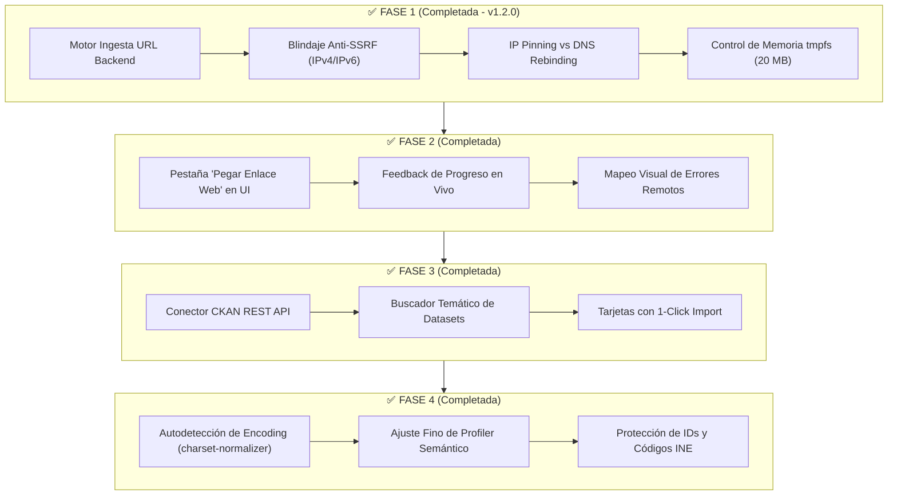

# 🗺️ DataFlow AI — Roadmap de Evolución Arquitectónica

**Versión del Roadmap:** 1.2.2  
**Estado General:** ✅ Todas las Fases Completadas (v1.2.2 — Hardening Muse Spark sin impacto en deploy)  
**Stack Base:** Python 3.11 · FastAPI · Pandas 2.2 · React 18 · TypeScript · Google Cloud Run  
**Autor:** [migueljerico](https://github.com/migueljerico)  

---

## 🎯 Visión y Principios Rectores

DataFlow AI es una plataforma ágil de preparación, calidad y transformación de datos diseñada para alimentar modelos y cuadros de mando en **Power BI**. 

El presente roadmap define la evolución del sistema desde la subida manual de archivos hacia la **ingesta directa por URL** y la **conexión con portales de Open Data**, bajo cuatro principios innegociables:

1. **Cero Infraestructura Adicional:** La app corre al 100% en el contenedor existente de Google Cloud Run sin añadir bases de datos externas, colas de mensajes (Redis/Celery) ni almacenamiento persistente de pago (S3/GCS).
2. **No Sobre-Ingeniería:** Diseñado para datasets de uso real y portfolio (hasta 20–30 MB), priorizando simplicidad y velocidad frente a complejidad distribuida innecesaria.
3. **Seguridad Defensiva en Profundidad (Security by Design):** Protección activa contra ataques *Server-Side Request Forgery* (SSRF) y *DNS Rebinding* (TOCTOU) para proteger la infraestructura interna de Cloud Run.
4. **Verificabilidad sin Programar:** Cada fase es entregable de forma independiente y verificable por una sola persona mediante pruebas funcionales de entrada/salida (I/O) y paneles visuales.

---

## 🧭 Diagrama General de Fases

---

## 📌 Detalle de Fases

### 🔹 Fase 1: Motor Backend de Ingesta por URL Segura
* **Estado:** ✅ **Completada (Release v1.2.0 — 24 de agosto de 2026)**
* **Objetivo:** Permitir que el backend descargue y procese datasets CSV/XLSX desde enlaces públicos con protección de red y control de memoria.
* **Qué se construyó:**
  1. **Módulo de Seguridad (`app/core/security_url.py`):**
     - Validación estricta de esquemas (`http://`, `https://`).
     - Bloqueo exhaustivo de rangos IPv4/IPv6 privados, loopback (`127.0.0.1`, `::1`), link-local (`fe80::/10`, `169.254.0.0/16` **GCP Metadata**), ULA (`fc00::/7`) e IPv4-mapped IPv6 (`::ffff:0:0/96`).
     - **IP Pinning:** Conexión fijada a la IP pública validada (`PinnedAsyncNetworkBackend`), mitigando ataques de *DNS Rebinding (TOCTOU)* y preservando *TLS SNI* en HTTPS.
     - Intercepción y revalidación de redirecciones HTTP (máx. 3 saltos).
  2. **Control de Memoria en Cloud Run (`tmpfs`):**
     - Streaming defensivo con límite de **20 MB** (`MAX_URL_FILE_SIZE_BYTES`) y timeout de 20s.
     - Limpieza automática preventiva (`_cleanup_old_uploads`) de archivos huérfanos en `uploads/`.
  3. **Endpoint:** `POST /api/v1/datasets/from-url` conectado al pipeline determinista.
  4. **Tests:** 47 nuevos tests automatizados (**76 tests en total, 100% en verde**).
* **Verificación Manual:** Pruebas en Swagger `/docs` con CSV público de GitHub (éxito 201), IP de metadatos `169.254.169.254` (bloqueo 400), e IPv6 `[::1]` (bloqueo 400).

---

### 🔹 Fase 2: Interfaz en React para Carga por URL con Feedback
* **Estado:** ✅ **Completada (24 de agosto de 2026)**
* **Objetivo:** Dotar a la aplicación web de una experiencia fluida para importar datasets pegando enlaces, sin necesidad de usar Swagger.
* **Qué se construyó:**
  1. Selector de modo en `FileUpload.tsx`: **"Subir Archivo Local"** | **"Pegar Enlace Web (URL)"**.
  2. Campo de entrada con validación en tiempo real (`http://` / `https://`) y botón interactivo *"Importar Dataset"*.
  3. Indicadores de estado visual: *"Conectando con el servidor..."* $\rightarrow$ *"Descargando dataset en streaming..."* $\rightarrow$ *"Analizando calidad y perfil semántico..."*.
  4. Botones de 1-clic con datasets públicos de prueba (PIB Mundial, Carsharing, Dataset Iris).
  5. Gestión y mapeo visual de errores ante enlaces no accesibles, archivos superiores a 20 MB o bloqueos de seguridad Anti-SSRF.
* **Verificación Manual:** Carga de URLs directas desde la UI con transición automática al Profiling Dashboard y comprobación de mensajes de error ante URLs privadas.

---

### 🔹 Fase 3: Conector a Portal Open Data (CKAN / Datos Abiertos)
* **Estado:** ✅ **Completada (24 de agosto de 2026)**
* **Objetivo:** Integrar un catálogo de datos abiertos para explorar y cargar datasets públicos reales con 1 solo clic.
* **Qué se construyó:**
  1. **Backend (`app/services/open_data_service.py`):**
     - Endpoints `GET /api/v1/datasets/open-data/search` y `GET /api/v1/datasets/open-data/featured`.
     - Integración con API pública estándar **CKAN (`package_search`)** con timeout defensivo y extracción automática de recursos CSV/XLSX.
     - Catálogo curado de datasets públicos de alta calidad (PIB Banco Mundial, Calidad del Aire, Movilidad, Demografía y Ventas).
     - Fallback tolerante a fallos si la API de CKAN externa no responde.
  2. **Frontend (`FileUpload.tsx`):**
     - Pestaña **"Explorar Open Data (CKAN)"** integrada en la interfaz de inicio.
     - Buscador temático por palabra clave (tráfico, economía, precios, energía) con filtros por etiquetas.
     - Tarjetas informativas con organismo emisor, formato y botón directo *"Importar a DataFlow"*.
   3. **Tests:** 5 tests automatizados de integración y mocking (`test_opendata.py`), complementando la suite total de **88 tests pasando al 100% en verde**.
* **Verificación Manual:**
  1. Acceder a la pestaña *"Explorar Open Data (CKAN)"* y realizar una búsqueda o filtrar por etiqueta.
  2. Pulsar *"Importar a DataFlow"* en cualquier tarjeta y verificar la descarga, profiling y generación del script ETL en Power BI.

---

### 🔹 Fase 4: Guardrails de Ingesta, `charset-normalizer` y Corrección Semántica
* **Estado:** ✅ **Completada (24 de agosto de 2026)**
* **Objetivo:** Blindar la ingesta contra codificaciones problemáticas y evitar falsos positivos en la clasificación de datos públicos.
* **Qué se construyó:**
  1. **Detección Estadística de Codificación (`charset-normalizer`):** Reconocimiento automático de `UTF-8`, `UTF-8 con BOM` (`\xef\xbb\xbf`), `Windows-1252` e `ISO-8859-1/15` en los primeros bloques del archivo, evitando caracteres corruptos (`ñ`, ``) y limpiando prefijos `\ufeff` en nombres de columnas.
  2. **Ajuste Fino de Inferencia Semántica:** Reglas reforzadas en `ProfilerService` para que códigos de INE (`08019`), códigos postales (`08001`, `28079`) o identificadores alfanuméricos (`id_precio_tarifa`, `id_alta_empleado`) se clasifiquen como `ID` y se preserven como `TEXT` (sin perder ceros a la izquierda ni sumarse erróneamente en Power BI).
  3. **Tests:** 6 nuevos tests en `test_phase4_guardrails.py`, elevando la suite completa a **88 tests automatizados (100% pasando en verde)**.
* **Verificación Manual:**
  1. Cargar un archivo en formato `Windows-1252` con tildes y comprobar que se normaliza a UTF-8 sin caracteres corruptos.
  2. Cargar datasets con columnas de códigos postales o referencias y verificar que en el Profiling se etiquetan con `hint: id` y `type: text`.

---

## 🚫 Decisiones de Diseño: Fuera de Alcance Justificado

Para garantizar la mantenibilidad y sostenibilidad del proyecto por una sola persona:

| Característica Excluida | Motivo Técnico de Exclusión |
| :--- | :--- |
| **Colas de Tareas (Celery, Redis, RabbitMQ, SQS)** | Añadiría costes y servicios adicionales innecesarios. Con descargas en streaming síncronas de < 20 MB, las peticiones se completan en 1–3 segundos. |
| **Almacenamiento S3 / Cloud Storage / MinIO** | Complejidad de credenciales IAM y costes recurrentes. El sistema de ficheros efímero (`tmpfs`) de Cloud Run es suficiente para el ciclo de vida de transformación. |
| **Protocolo TUS / Subida Multipart compleja** | Diseñado para archivos de gigabytes; sobre-ingeniería para datasets de análisis moderado. |
| **Migración a DuckDB, Polars o Spark** | Rompería la compatibilidad del motor determinista (`TransformationRegistry`) y los 88 tests existentes sin aportar valor perceptible para archivos ≤ 20 MB. |
| **Múltiples APIs Open Data simultáneas** | Cada portal tiene esquemas dispares. Implementar el estándar CKAN cubre miles de fuentes públicas con una sola base de código limpia. |

---

## 📊 Matriz de Esfuerzo y Trazabilidad

| Fase | Entregable Principal | Esfuerzo | Tests Pytest | Estado |
| :---: | :--- | :---: | :---: | :---: |
| **1** | Backend URL Loader + Anti-SSRF + IP Pinning + `tmpfs` | Pequeño-Medio | 77 / 77 | ✅ **Completada (v1.2.0)** |
| **2** | UI React Carga URL + Feedback en Vivo | Pequeño | — | ✅ **Completada** |
| **3** | Conector CKAN Open Data + Buscador en UI | Mediano | 82 / 82 | ✅ **Completada** |
| **4** | `charset-normalizer` + Profiler Semántico Robusto | Pequeño-Medio | 88 / 88 | ✅ **Completada** |

---

  <b>DataFlow AI</b> · <i>From raw business data to clean, trusted and actionable insights.</i> 
  Documentado y mantenido por <a href="https://github.com/migueljerico">@migueljerico</a> · 2026

